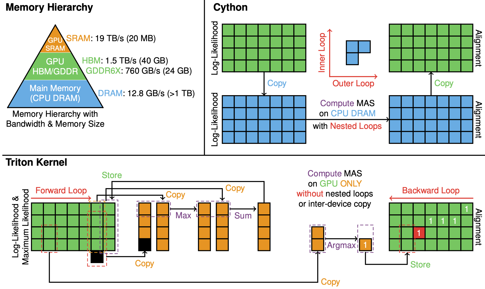
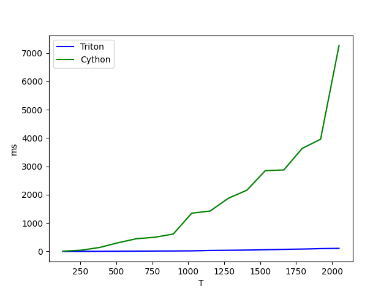
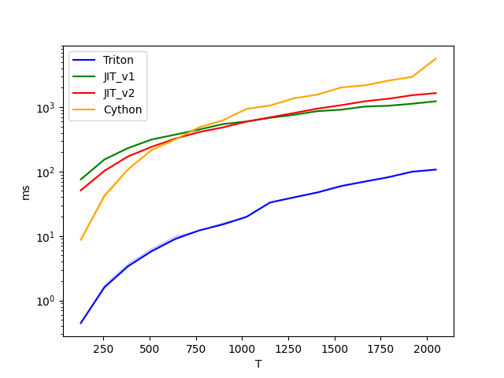

# Super-Monotonic-Alignment-Search

This repo contains [Triton-Lang](https://github.com/triton-lang/triton) and PyTorch implementation of the monotonic alignment search (MAS), originally from [Glow-TTS](https://arxiv.org/abs/2005.11129).
MAS is an effective algorithm for estimating the alignment between paired speech and text in a self-supervised manner.




The authors of Glow-TTS noted:
> "The time complexity of the algorithm is O(T_{text} × T_{mel}). Even though the algorithm is difficult to parallelize, it runs efficiently on CPU without the need for GPU executions. In our experiments, it spends less than 20 ms on each iteration, which amounts to less than 2% of the total training time. Furthermore, we do not need MAS during inference, as the duration predictor is used to estimate the alignment."

However, we found three issues while using MAS.
1. MAS can be parallelized in the text-length dimension, while the original implementation uses nested loops.
2. CPU execution consumes an inordinate amount of time for large inputs due to the need to copy large tensors between CPU and GPU.
3. The hard-coded value of max_neg_val at -1e9 is insufficient to prevent alignment mismatches in the upper diagonal parts.

Therefore, we implemented a Triton kernel `super_monotonic_align` and PyTorch code `jit_monotonic_align` to accelerate MAS on GPU without inter-device copy.

# Requirments
1. PyTorch (tested with version `torch==2.3.0+cu121`)
2. Triton-Lang (tested with version `triton==2.3.0`)
3. Cython (optional for bench, tested with version `Cython== 0.29.36`)

Please ensure you have these packages installed to run the code in this repository, as version checks are not enforced.

# How to use
1. Install super-monotonic-align
```
git clone git@github.com:supertone-inc/super-monotonic-align.git
cd super-monotonic-align; pip install -e ./
```
or
```
pip install git+https://github.com/supertone-inc/super-monotonic-align.git
```
2. Import `super_monotonic_align` and use it!
```python
from super_monotonic_align import maximum_path
...
# You need to know value's value is modified by triton kernel.
# If you want to keep value without changing, you need to clone it before maximum_path.
# B: batch_size, T: text_length, S: audio_length
value = torch.randn((B, T, S), dtype=torch.float32, device='cuda')
attn_mask = torch.ones((B, T, S), dtype=torch.int32, device='cuda')
# path: [B,T,S] tensor, you can specify path's dtype, default=torch.float32
path = maximum_path(value, attn_mask, dtype=torch.bool)
```

# Benchmark
```
MAS in ms:
         T      Triton       JIT_v1       JIT_v2       Cython
0    128.0    0.447488    83.742203    53.222176     8.819136
1    256.0    1.616896   155.424774   104.632477    43.533665
2    384.0    3.430400   325.307404   237.820435   136.257538
3    512.0    5.838848   439.984131   344.654236   304.981201
4    640.0    9.070592   532.910095   452.141907   462.405304
5    768.0   12.249088   655.960083   587.169739   488.272858
6    896.0   15.203328   557.997070   620.148315   863.919067
7   1024.0   19.778561   627.986450   815.933167  1299.567871
8   1152.0   33.276928   706.022400   968.533813  1467.056885
9   1280.0   39.800835   792.861694  1215.021240  1930.171509
10  1408.0   47.456257   903.750671  1289.656250  2231.598145
11  1536.0   59.238914   953.907227  1523.870972  2959.377930
12  1664.0   70.068741  1031.818237  2004.299438  3073.532471
13  1792.0   82.205696  1558.200317  2359.347900  3930.776367
14  1920.0   99.634689  1183.214600  2512.063477  4374.311035
15  2048.0  107.218948  1261.682739  2889.841797  7792.640137
```

The Triton MAS implementation is at least 19 times faster and up to 72 times faster than the Cython implementation. PyTorch JIT implementations are faster than the Cython implementation for large-sized tensors, especially version v1, which does not involve inter-device copying.

| ms in linear scale | ms in log scale |
|----------|----------|
|  |  |

## How to run benchmark
```bash
cd cython_monotonic_align; mkdir cython_monotonic_align; python setup.py build_ext --inplace
cd ../super_monotonic_align; pip install -e ./
cd ../; python test.py
```

# References
This implementation uses code from following repositories:
- [jaywalnut310's Official Glow-TTS Implementation](https://github.com/jaywalnut310/glow-tts)
- [OpenAI's Triton-Lang Tutorials](https://github.com/triton-lang/triton)
- [Tri Dao's FlashAttention (memory hierarchy)](https://github.com/Dao-AILab/flash-attention)


# Authors
- Junhyeok Lee ([jlee843@jhu.edu](mailto:jlee843@jhu.edu), [jun.hyeok@supertone.ai](mailto:jun.hyeok@supertone.ai))
- Hyoungju Kim ([hyeongju@supertone.ai](mailto:hyeongju@supertone.ai))


Feel free to create an issue if you encounter any problems or have any questions.

Additionally, [Supertone](https://supertone.ai) is hiring TTS researchers. 
If you are interested, please check out our career opportunities!
